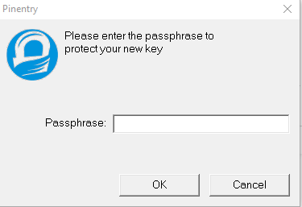

# Key shard sharing using PGP

## prerequisite

- [Chocolatey](https://chocolatey.org/docs/installation) is installed

## Generate PGP key pair

- Fire up powershell and install GnuPG using the following command:
`choco install gnupg`

- Refresh powershell environment by executing: `refreshenv`

We need to generate a new key pair by using the following command: `gpg --gen-key`
- Executing this line will ask you for some information
    -   **Real name**:  Name bound to the generated secret
    -   **Email address**:  email bound to the generated secret
    - Confirm the submitted data using O(kay)
- After filling in the information a prompt will be shown, something like 

    

    **The passphrase you need to fill in is the passphrase that you can use to decrypt later. (So remember yours!!!!)**
- Confirm your passphrase.

That's it! You generated your first PGP key pair!

## Export public key

To use your personall key in Vault to encrypt your shard, you need to export your public key.

- Export your key using: `gpg --output <filename>.pgp --export <YourEmailAddressProvided>`

That's it! The exported file can be used by the initialisation of Vault.

## Decrypt your personal key shard

To unseal Vault, an X amount of shards need to be provided. To use your personal shard, we first need to decrypt it!

-   To decrypt your encrypted shard we first need to base64 decode your shard.
    `$bytes = [Convert]::FromBase64String('<yourEncryptedShard>')`
-   After decoding your shard, you need to save the content as an .PGP file format.
    `[IO.File]::WriteAllBytes('./encryptedShard.pgp', $bytes)`
-   The created file (encryptedShard.pgp) can now be decrypted using the following command:
    `gpg -dq .\encryptedShard.pgp`

    This command will ask you for your passphrase, this is the passphrase that chose in the steps for generating a GPG key pair.

