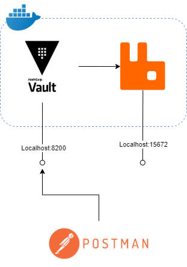

# Secretmanagement with Hashicorp vault
This demo will show you how the audit trail of vault can be used, together with the dynamic secrets capabilities of Vault using the RabbitMQ secret backend.

In this repo, you will find a postman collection that contains all the requests that you need to get started.

## Prerequisites
This demo asserts that you have the following software installed:
- [Docker(-compose)](https://www.docker.com/)
- [Postman](https://www.postman.com/)
 

## Getting started
Follow the following steps to get started with the demo.

1. Clone this repository: `git clone https://github.com/tom171296/SecretManagement-Vault.git`.
2. Navigate to the root forlder `cd SecretManagement-Vault`.
3. Run the following command `docker-compose up`, this will start all the required services for this demo.
4. Import the postman collection `VaultRabbitMQDemo.postman_collection.json` via the import button in postman. 

The setup looks like the picture below:

Now that you have everything running, you can start with configuring vault. The configuration of vault consist of a few steps.

1. At first, you need to enable the audit trail. This settings tells Vault to keep track of everyone whom has accessed the api and requested what secret. To enable the audit trail run `1. enable audit trail` of the postman collection.
2. The second step that you need to do is activating the RabbitMQ secret backend of Vault. As described in my [blog](https://blognet.tech/2021/SecretManagementHashicorpVault/), Vault needs to have a secret backend activated so vault knows how and for what it needs to create secrets. To activate the RabbitMQ secret backend run `2. Enable RabbitMQ`.
3. After activating the RabbitMQ backend, you need to tell Vault for which RabbitMQ instance it needs to create secrets. To connect Vault to RabbitMQ run `3. Connect Vault to RabbitMQ`.
4. Vault needs to know how long a dynamic secrets lease should take. A dynamic secret can only be valid a certain amount of time. To configure the lease duration for the RabbitMQ backend run `4. Configure lease duration`.
5. Each application has an unique secret. To enable this with Vault, you need to create a role for the application in the RabbitMQ backend. To create a role for the RabbitMQ backend run `5. Create RabbitMQ role`. This call will create the role that is used to create an account in RabbitMQ. In the body of the call is defined what rules are bound to this role and are used in the creation of the account in RabbitMQ.
6. Now Vault is fully configured, you can acces Vault to create a secret for RabbitMQ. To get a secret from RabbitMQ run `Get RabbitMQ credentials`. This call will let Vault create a new secret in RabbitMQ. The result will have an username and password that can be used to login into RabbitMQ.